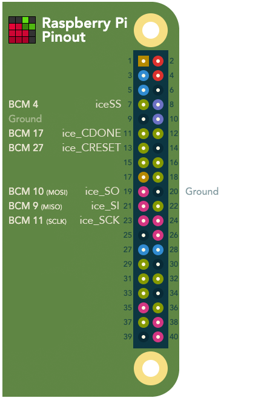

# iceprog native Raspberry Pi SPI version

this iceprog version is meant for programming the ice40 FPGA flash via the native Raspberry Pi SPI Interface. 
It's core code comes from this repro: https://github.com/cliffordwolf/icestorm

## Warning

This is very alpha! I just tested it with an Icebreaker and an Raspberry 3B+ in flash mode and it works.
Use at your own risk.  
This will only be able to flash the external SPI Flash, direct SRAM mode will not work due to swapped MISO/MOSI lines.

## Build

NOTE: at first you need to enable the HW SPI Interface via raspi-config and reboot.   

```
mkdir build
cd build
cmake ..
make
```

## Usage

```
./iceprog-rpicsi flash.bin
```

## Pin connections


## SPIDEV Driver limitations

By default the spidev driver on raspberry pi has a maximum transfer size of 4096 bytes.  
That might cause problems with this software so to change the default buffersize add `spidev.bufsiz=65536` to `/boot/cmdline.txt` and reboot.   
Where 65536 is the maximum size you want to allow.
